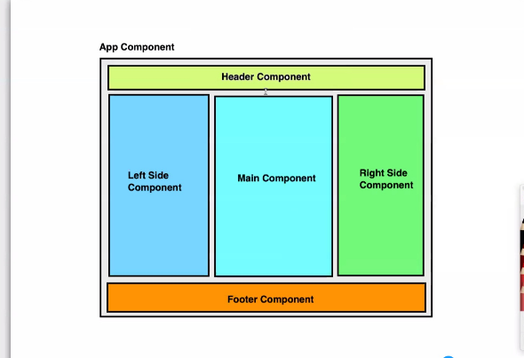

## Angular
-It was originally developed in 2009 by Misko Hevery and Adam Abrons. It is now maintained by Google.
- framework(collection of Js,html and css files) used to design client side application
- the angular application will be executed by browser
- used to develop ***SPA(single page application)*** type application
  - the angular applicaiton will load only one page at the beginning 
  - then it will kep on refreshes only part(s) of pages
- **benifit of Angular**
     - best performance like native application
     - because the entire UI gets loaded at the beginning , application works in case of no internet connection(provided the application is already loaded in browser) 
- **disadvantages** 
     - the application takes more time to start

- **alternative to angular--> (by google)**

     - vue.js by alibaba
     - react-facebook


 (fast reloading)
- typescript will be used for developing applications using angular
     - the typescript code will get transpiled to javascript
     - the transpiled JS code will get passed to the browser

#### configuration 
- documentation 
> angular.io

- to install angular framework use npm install command
```bash
npm install -g @angular/cli


```
- #angular/cli install a utility name **ng** (angular)


### ng 

- used  to create/build/test angular application.
- **ng new**
     - used to create a new angular application
     - e.g 
     ```bash
      > ng new my-app  
     ```


- **ng serve**

  - The ng serve command launches the server, watches your files, and rebuilds the app as you make changes to those files.
  - used to run the application
  ```bash
   # visit localhost:4200 
    > sudo ng serve
     # visit localhost:4200 
    > sudo ng serve --port 9090
    //open in browser at # localhost:4200 
    ng serve --open 
     # visit localhost:4200 
    # --host = will accept incoming connection from networking
    ng serve --host '0.0.0.0'

    // if folder access is restricted 
    //it showns you are not the owner
     use

     sudo chown -R username /path/to/directory-ofapp-folder

  ```

- **ng generate**
 - used to create different types of classes
    - **components**
      - used to create a component
      - create files with .html,.css,.ts and .spec.ts extensions
      - declares the components in the AppModule 
 - e.g
  ```bash
           # create component 
         ng generate component first
        #or use
        
        
       ng g c third

  ```

### angular project hierarchy (in app1 folder)
- **e2e folder**
  -  +  end to end testing
     +  used to test the application's functionality

- **node modules**
  - directory which contains all the dependency modules
   - e.g 
    - @angular/animations : used to add animation support in the application
    - @angular/cli : used for managing the application 
    - @angular/core: used to provide fundamental components to the application 
    - @angular/forms  : used to add the forms support
    (used to get input from user)
    - @angular/router : used to add routing facility
    - @angular/commong/http: used to provide HttpClient which can be used to connect the angular application with backend
    
- **src folder**
 
   - **app**
     +  contains the application source code 
   - **assets**
      + contains the application assets
      + like images,audio or videos 
   - **environments**
      + used to separate the configuration logically
      + e.g 
        - environment.ts : represent the dev environment
        - environment.prod.ts : respresents the production(cloud server) environment
   - **favicon.ico** 
       + usd to display the shortcut icon 
       + the ne which will be displayed on the tab

   - **index.html**
       + the only hmtl file which has header and body
       + the applicaiton starts by loading this file
   - **main.ts**
       + angular's entry point 
       +  when applications starts,the application modules get bootstrapped using main.ts
   - **polyfill.ts**
       + used to fill the gap between older JS version with latest ES7/ES8 changes

   - **styles.css**
       + used to add global styles
       + the styles which can be shared with multiple component
   - **test.ts**
       + used to test end to end application 

    - **in app1 folder ** 
      - **editorconfigs**   
          + used to configure the editors 
     
    - **gitignore**
        + used to ignore the files/folders while commiting the changes to git repository    
    - **angular.json**
        + used to configure the application
    - **karma.config.js**
        + configuration used by jasmin 
    - **package.json**
        + configuration on your application 
        + e.g 
          - applicaiton dependencies
          - application basic information
     
    - > **README.md**
        + used to configure the readme for your application   
    - **tsconfig.json**
    - **tsconfig.json**
        + used to configure the typescript  
    - **tsconfig.spec.json**
        + used for configuring the test cases    
    - **tslint.json**
        +                       

### NgModule    
- every angular application is a modular application
- every angular application requiress at least one NgModule
- NgModule represents a module which brings all the application parts together
- Ngmodule is different than node module 
- to create a angular module , call 
@NgModule Decorator

```ts
@NgModule({
  declarations: [
    AppComponent
  ],
  imports: [
    BrowserModule
  ],
  providers: [],
  bootstrap: [AppComponent]
})
export class AppModule {}

```
- @NgModule is called with metadata in {} which contains
1. **declarations**
   - list of components , pipe,etc in the application
2. **imports**
  - list of modules require to run   the current module
3. **providers**
  - list of service classes used in application 
4. **bootstrap**
  - the components need to be loaded by default when the module gets loaded
5. **exports**
  - list of components,pipes,etc. exported current module   


### Component 

<hr>

1. In angular,component represents a screen (page) or part of page 
2. angular application development is a component 
3. contains files
 - .html
 - .ts
 - .css
 - spec.ts
3.  to create a component 

  - 1. step- create a class and call a decorator @component()
      -decorator accepts a metadata
       
       1. selector
        - used to load the component in a parent component
        - use it as a tag
        - e.g.
        - \<app-root>\</app-root>  
       2. templateUrl
       - used to attach the view (html) which is the screen design
       - use it for designing the component uI
       3. styleUrls:
       - used to attach the style on the html loaded in the component


```ts
  @Component({
  selector: 'app-root',
  templateUrl: './app.component.html',
  styleUrls: ['./app.component.css']
})
export class AppComponent {
  title = 'my-app';
}
```

    - 2. step- Register the component in AppModule's declarations array


### binding 

- attaching one part to another
- types 
 - 1. **Property Binding**
     - 1. **string interpolation**
    - way to get value from a class member
    - wrap the class member with {{}}
    - e.g 
    ```html
    <!-- string interpolation getting value of firstName-->
      <div> Firstname : {{firstName}} </div> 
    ```
    ```ts
    
      export class FirstComponent{
          //class member
          firstName = 'steve'
      }

    ```
     - 2.  **Attribute  Binding**  
        - used to bind value of a variable with an attribute
        - wrap the attribute in [] for binding the value with variable 
        - e.g
        ```html
            <div>Color: {{color}}</div>
          <div [style.color]="color">Color: {{color}}</div>
          
          <div
           [style.width]="size"
           [style.background-color]="color" > </div>
        ```
   ```ts
   export class SecondComponent implements OnInit {
  color = 'green'
  size = 100
  
    }

   ```
     - 3. **Class binding**

    - 4. **Event bindiing** 