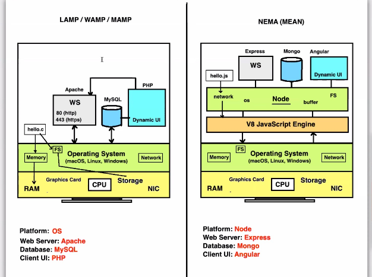

## LAMP/WAMP/MAMP
- stand for 
- Linux/Window/Mac
- Apache
- MySQL
- PHP

- platform : its the OS that 
provides the communication with hardware, in the stack
+ disadvantages
1 . different languages on client and server side

## new module to solve this probem 
we get 
# MEAN 
-  can be solved by using Javascript on both sides
- interpreter outside the browser, 
taken out js engine outside of browser and made it a utility 
- made a **node** over the js engine:
-  a framework working on the js engine which is taken    out , like V8 js engine 
- so now we have network,os,buffer,file system, on node, above js engine known as a **node framework**.
- now a file 
- >hello.js --> V8 js engine ---> OS
- so now program talking to node framework,having all needed for application to work

1. so now our **platform** is **Node-Js/Node**

2. so now Our **webserver** here is **Express** outside the browser
3. for database use **Mongo,MySQL**

4. so on server side we use language called **js**
  - which will build dynamic / **client side UI** for us.

  - so we get **MEAN**

